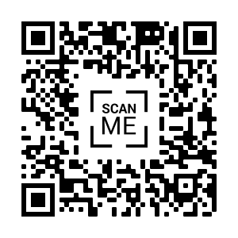

## About Me

- Mario Bifulco `mario.bifulco@unito.it`
- PhD student in Computer Science
- Main interest: Quantum Optimization

---

## Roadmap

:::: {.columns}
::: {.column width="50%"}
1. [IBM](2_ibm.html)
2. [IQM](3_iqm.html)
3. [BlueQubit](4_bluequbit.html)
4. [DWave](5_dwave.html)
5. [Quantinuum](6_quantinuum.html)
6. [End](7_outro.html)
:::

::: {.column width="50%"}
{width="300px"}
:::
::::

---

## What This Seminar Is About

**Goal**

Build a quantum *job submitter*

. . .

> *"The best way to understand a quantum computer is to program one."*

---

## Quantum "Hello World"

```{python}
#| echo: true
#| eval: true
#| fig-align: center
from qiskit import QuantumCircuit

qc = QuantumCircuit(2)
qc.h(0)
qc.cx(0, 1)
qc.measure_all()
qc.draw('mpl') # Draw Bell state
```

---

## Next step

[Run on IBM](2_ibm.html)
